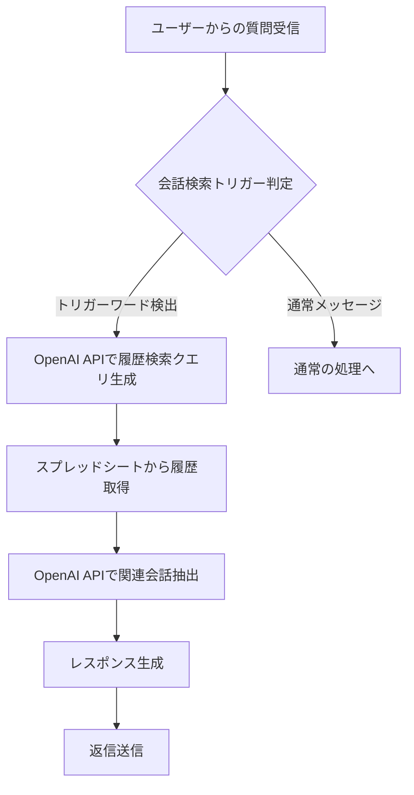
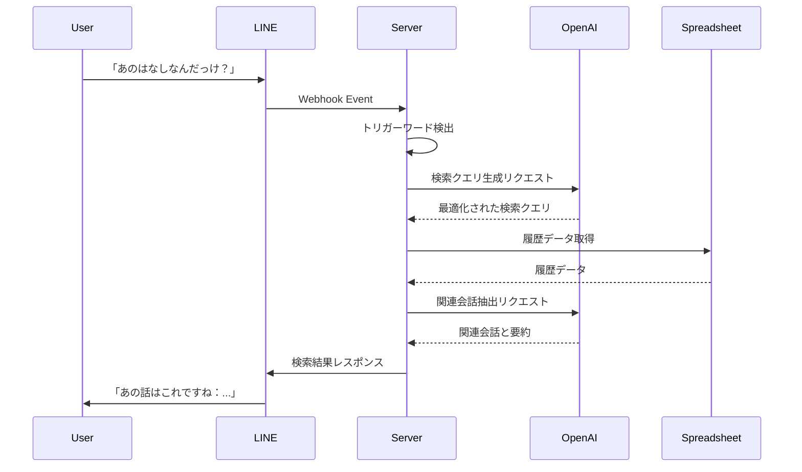

# 会話検索機能設計書

## 機能情報
- **タイトル**: 会話検索機能「あのはなしなんだっけ？」
- **バージョン**: 0.1.0
- **優先度**: high
- **予想開発時間**: 1週間

## フロー図

### 処理フロー


### API連携フロー


## 概要
### 説明
ユーザーが「あのはなしなんだっけ？」「先日話していた〇〇について教えて」などと質問すると、OpenAI APIを活用してグループの会話履歴から関連する過去の会話を検索し、要約して返答する機能です。自然言語での曖昧な質問に対しても適切な文脈を理解し、関連する過去の会話を見つけ出します。

### 目的
グループ内で過去に話した内容を簡単に思い出せるようにすることで、会話の連続性を高め、グループコミュニケーションを活性化させます。特に時間が経過した後でも過去の会話を簡単に参照できるようにすることで、ユーザー体験を向上させます。

### ユーザーストーリー
1. ユーザーが「あのはなしなんだっけ？」と質問する
2. ボットが過去の会話履歴から関連する話題を検索
3. 検索結果を要約して返信
4. 必要に応じて、詳細な会話内容も提供

## 技術仕様

### データフロー
1. LINE Webhookからメッセージを受信
2. トリガーワードを検出（「あのはなし」「思い出して」など）
3. OpenAI APIを使用して検索クエリを最適化
4. スプレッドシートから会話履歴を取得
5. OpenAI APIを使用して関連する会話を抽出・要約
6. 結果をLINEメッセージとして返信

### トリガーワード検出
以下のようなフレーズを検出した場合に会話検索機能を起動します：
- 「あのはなしなんだっけ？」
- 「前に話してた〇〇について教えて」
- 「思い出して」
- 「検索して」
- その他、過去の会話を参照する意図が含まれるフレーズ

### OpenAI API連携
#### 検索クエリ生成
```typescript
interface QueryGenerationRequest {
  userMessage: string;
  recentMessages: MessageData[];
}

interface QueryGenerationResponse {
  searchQuery: string;
  confidence: number;
}

async function generateSearchQuery(request: QueryGenerationRequest): Promise<QueryGenerationResponse> {
  const response = await openai.chat.completions.create({
    model: "gpt-4-turbo",
    messages: [
      {
        role: "system",
        content: "あなたはLINEグループの会話履歴を検索するためのクエリ生成アシスタントです。ユーザーの曖昧な質問から、過去の会話を検索するための最適なクエリを生成してください。"
      },
      {
        role: "user",
        content: `ユーザーメッセージ: "${request.userMessage}"\n\n最近の会話: ${JSON.stringify(request.recentMessages, null, 2)}`
      }
    ],
    temperature: 0.7,
  });

  const content = response.choices[0].message.content;
  // JSONパースまたは構造化データの抽出
  const result = JSON.parse(content);
  
  return {
    searchQuery: result.searchQuery,
    confidence: result.confidence
  };
}
```

#### 関連会話抽出
```typescript
interface ConversationSearchRequest {
  searchQuery: string;
  conversations: MessageData[];
  maxResults: number;
}

interface ConversationSearchResponse {
  relevantConversations: {
    messages: MessageData[];
    relevanceScore: number;
    summary: string;
  }[];
  overallSummary: string;
}

async function searchConversations(request: ConversationSearchRequest): Promise<ConversationSearchResponse> {
  const response = await openai.chat.completions.create({
    model: "gpt-4-turbo",
    messages: [
      {
        role: "system",
        content: "あなたはLINEグループの会話履歴から関連する会話を検索・要約するアシスタントです。検索クエリに基づいて最も関連性の高い会話を見つけ、要約してください。"
      },
      {
        role: "user",
        content: `検索クエリ: "${request.searchQuery}"\n\n会話履歴: ${JSON.stringify(request.conversations, null, 2)}\n\n最大結果数: ${request.maxResults}`
      }
    ],
    temperature: 0.7,
  });

  const content = response.choices[0].message.content;
  // JSONパースまたは構造化データの抽出
  const result = JSON.parse(content);
  
  return result;
}
```

### レスポンス生成
```typescript
interface ResponseGenerationRequest {
  searchResults: ConversationSearchResponse;
  originalQuery: string;
}

interface ResponseGenerationResponse {
  message: string;
  shouldIncludeDetails: boolean;
}

async function generateResponse(request: ResponseGenerationRequest): Promise<ResponseGenerationResponse> {
  const response = await openai.chat.completions.create({
    model: "gpt-4-turbo",
    messages: [
      {
        role: "system",
        content: "あなたはLINEグループの会話履歴検索結果を自然な形で返答するアシスタントです。検索結果を元に、ユーザーの質問に対する適切な返答を生成してください。"
      },
      {
        role: "user",
        content: `元の質問: "${request.originalQuery}"\n\n検索結果: ${JSON.stringify(request.searchResults, null, 2)}`
      }
    ],
    temperature: 0.8,
  });

  const content = response.choices[0].message.content;
  // 構造化データの抽出
  const shouldIncludeDetails = content.includes("詳細情報を含める") || request.searchResults.relevantConversations.length <= 2;
  
  return {
    message: content.replace(/詳細情報を含める/g, "").trim(),
    shouldIncludeDetails
  };
}
```

## 実装ステップ

### 1. サービスの実装

`src/services/conversationSearch.ts` に以下の機能を実装します：

- `detectSearchIntent`: メッセージから検索意図を検出
- `generateSearchQuery`: OpenAI APIを使用して検索クエリを生成
- `fetchConversationHistory`: スプレッドシートから会話履歴を取得
- `searchConversations`: OpenAI APIを使用して関連会話を検索
- `generateResponse`: 検索結果に基づいてレスポンスを生成
- `formatResponseMessage`: LINE用のメッセージフォーマットに変換

### 2. ハンドラーの実装

`src/handlers/conversationSearch.ts` に以下の機能を実装します：

- `handleConversationSearch`: 会話検索のメインハンドラー
- `isSearchQuery`: 検索クエリかどうかを判定

### 3. Webhookハンドラーの更新

`src/handlers/webhook-handler.ts` を更新して会話検索処理を組み込みます：

```typescript
const results = await Promise.all(events.map(async (event) => {
  // トーク履歴の保存
  await handleTalkHistory(event);
  
  // 会話検索クエリかどうかを判定
  if (event.type === 'message' && event.message.type === 'text') {
    const isSearchQuery = await conversationSearchHandler.isSearchQuery(event.message.text);
    if (isSearchQuery) {
      return conversationSearchHandler.handleConversationSearch(event);
    }
  }
  
  // 通常のメッセージ処理
  return handleMessage(event);
}));
```

## セキュリティ考慮事項
- OpenAI APIキーの安全な管理
- ユーザー情報のプライバシー保護
- センシティブな会話内容の適切な取り扱い
- APIレート制限の管理

## テスト計画
1. トリガーワード検出のユニットテスト
2. OpenAI API連携の統合テスト
3. 会話検索精度のテスト
4. エラーケースのテスト
5. パフォーマンステスト（大量の履歴データでの検索）

## 監視計画
- OpenAI APIの使用量と制限
- 検索クエリの成功率
- レスポンス生成時間
- ユーザー満足度（フィードバック機能の実装も検討）

## 展開計画
1. 開発環境での機能実装
2. テスト環境でのバグ修正と精度向上
3. ステージング環境での検証
4. 本番環境への段階的デプロイ

## 将来の拡張可能性
- 検索精度の向上（埋め込みベクトルデータベースの導入）
- 特定のユーザーやトピックに絞った検索機能
- 時間範囲を指定した検索機能
- 画像や添付ファイルの内容も含めた検索機能
- 検索結果の可視化（タイムライン表示など）
