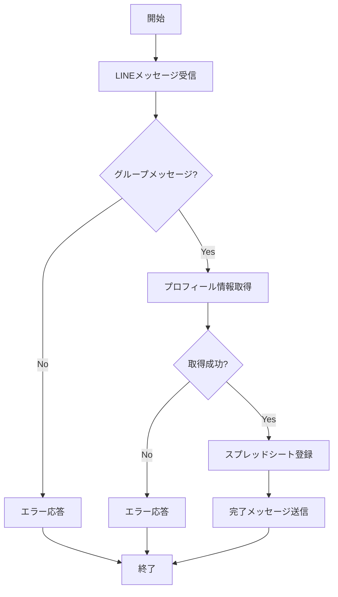
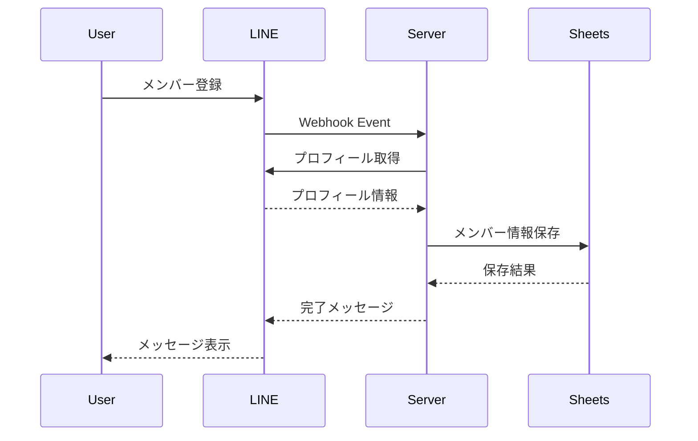

# 機能設計書

## 機能情報
- **タイトル**: グループメンバー登録機能
- **バージョン**: 0.1.0
- **優先度**: high
- **予想開発時間**: 2時間

## フロー図

### 処理フロー

### API連携フロー

## 概要
### 説明
LINEグループのメンバー情報をスプレッドシートで管理する機能です。メンバーのプロフィール情報をLINE APIから自動取得し、スプレッドシートに登録します。

### 目的
- グループメンバーの一元管理
- プロフィール情報の自動取得による正確性確保
- メンバー情報の履歴管理

### ユーザーストーリー
1. ユーザーがグループで「メンバー登録」と入力
2. システムが自動的にプロフィール情報を取得
3. スプレッドシートに情報を保存
4. 登録完了を通知

## プロジェクト参照
- **リポジトリ**: https://github.com/yu-Yoshiaki/line-kakeibo
- **関連ドキュメント**:
  - [/docs/dev-structure.yaml]

## 依存関係
### API
- LINE Messaging API
- Google Sheets API

### ライブラリ
| ライブラリ名 | バージョン | 使用目的 |
|------------|-----------|--------|
| @line/bot-sdk | latest | LINE Bot機能 |
| googleapis | latest | スプレッドシート操作 |

## データ構造
### スプレッドシート
- シート名: `メンバー`
- 列構成:
  | 列 | 内容 | 型 |
  |----|------|-----|
  | A | ユーザーID | string |
  | B | 表示名 | string |
  | C | グループID | string |
  | D | 登録日時 | ISO8601 |

## エラーハンドリング
- グループ外での実行: 「この機能はグループでのみ使用できます」
- 重複登録: 「このメンバーは既に登録されています」
- プロフィール取得失敗: 「プロフィール情報の取得に失敗しました」

## セキュリティ
- LINE Botのチャネルアクセストークン管理
- Google Sheets APIの認証情報管理
- グループメンバーのプロフィール情報アクセス権限確認
