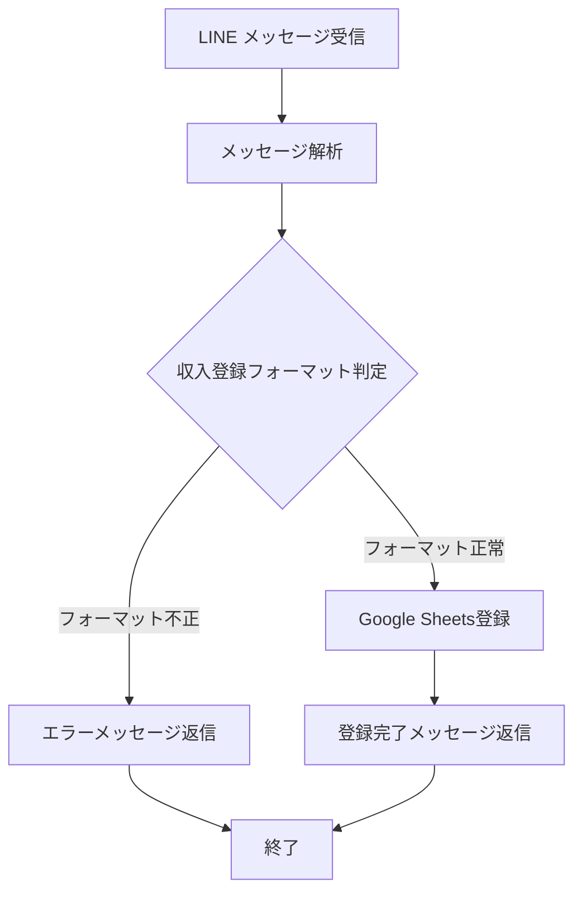
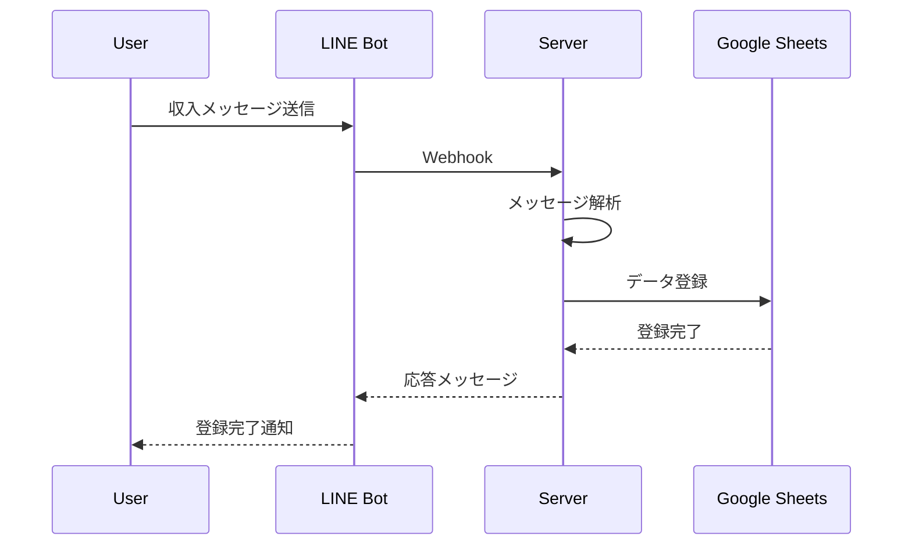

# 収入登録機能設計書

## 機能情報
- **タイトル**: 収入登録機能
- **バージョン**: 0.1.0
- **優先度**: high
- **予想開発時間**: 3日

## フロー図

### 処理フロー


### メッセージフロー


## 機能詳細

### メッセージフォーマット
- 基本フォーマット: `収入 [金額] [収入種別] [取引先] [メモ]`
- 例: `収入 250000 給与 株式会社ABC 1月分給与`

### 収入種別一覧
- 事業収入
- 給与
- 副収入
- その他収入

### データ構造
```yaml
income:
  - transactionId: String  # 取引ID（自動採番）
  - date: Date            # 取引日
  - category: String      # 収入種別（事業収入、給与、副収入など）
  - amount: Number        # 金額
  - client: String        # 取引先
  - memo: String          # 備考・メモ
```

### エラーハンドリング
1. フォーマットエラー
   - 原因: メッセージフォーマットが不正
   - 対応: フォーマット例を含むエラーメッセージを返信

2. カテゴリーエラー
   - 原因: 未定義のカテゴリーが指定
   - 対応: 利用可能なカテゴリー一覧を返信

3. 金額エラー
   - 原因: 金額が数値でない、または負の値
   - 対応: 正しい金額フォーマットを説明するメッセージを返信

## 実装詳細

### 必要なファイル
1. `src/handlers/income-handler.ts`
   - 収入メッセージの処理ロジック
   - メッセージフォーマットのバリデーション
   - Google Sheets登録処理の呼び出し

2. `src/services/sheets.ts`の拡張
   - 収入データ登録用のメソッド追加
   - 収入データ用のシート操作機能

### テスト項目
1. メッセージ解析テスト
   - 正常系: 正しいフォーマットのメッセージ
   - 異常系: 不正なフォーマットのメッセージ

2. カテゴリーバリデーションテスト
   - 正常系: 定義済みカテゴリー
   - 異常系: 未定義カテゴリー

3. Google Sheets登録テスト
   - データ登録の成功確認
   - エラーハンドリングの確認

## 期待される結果
1. ユーザーは簡単なメッセージで収入を記録できる
2. 収入データがGoogle Sheetsに正しく記録される
3. エラー時に適切なガイダンスを受けられる
4. 月次レポートに収入データが反映される
