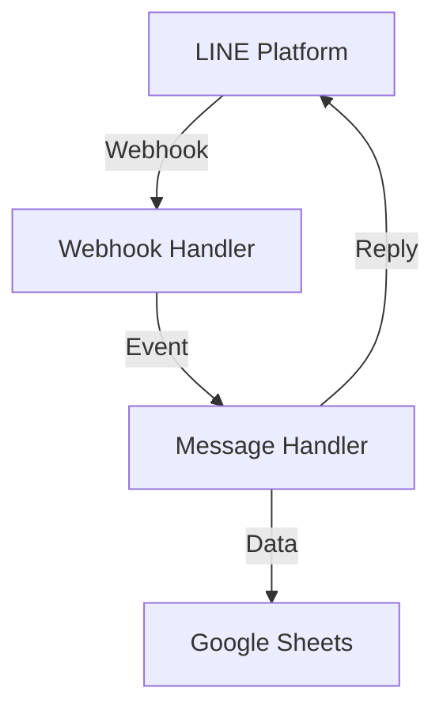

# LINE Bot メッセージハンドラー実装仕様書

## 概要
LINE Messaging APIを使用して、ユーザーから送信された支出情報を受信・処理し、Google Sheetsに保存するBotを実装します。

### 目的
- ユーザーがLINEで簡単に支出を記録できる
- 家計簿データをGoogle Sheetsで一元管理する
- 正確なデータ抽出と保存を実現する

## LINE Bot SDK設定

### 1. 設定オブジェクト
```typescript
// src/config/line.ts
import * as line from '@line/bot-sdk';

// LINE SDK config
const config = {
  channelSecret: process.env.CHANNEL_SECRET,
};

// LINE SDK client
const client = new line.messagingApi.MessagingApiClient({
  channelAccessToken: process.env.CHANNEL_ACCESS_TOKEN
});
```

### 2. Webhook処理

#### 2.1 ルーティング設定 (`src/routes/webhook.ts`)
```typescript
import { Hono } from 'hono';
import { webhookHandler } from '../handlers/webhook-handler';

const router = new Hono();

// Webhookエンドポイントの設定
router.post('/webhook', webhookHandler);

export default router;
```

#### 2.2 Webhookハンドラー (`src/handlers/webhook-handler.ts`)
```typescript
import { Context } from 'hono';
import * as line from '@line/bot-sdk';

export async function webhookHandler(c: Context) {
  const signature = c.req.header('x-line-signature');
  const rawBody = await c.req.text();
  
  // 署名検証
  if (!signature || !line.validateSignature(rawBody, config.channelSecret, signature)) {
    return c.text('Invalid signature', 403);
  }

  try {
    const body = JSON.parse(rawBody);
    const events: line.WebhookEvent[] = body.events;

    // 全てのイベントを処理
    const results = await Promise.all(
      events.map(handleMessage)
    );

    return c.json(results);
  } catch (err) {
    console.error('Webhook error:', err);
    return c.text('Internal Server Error', 500);
  }
}
```

### 3. メッセージハンドラー
```typescript
// src/handlers/message.ts
import * as line from '@line/bot-sdk';

async function handleEvent(event: line.WebhookEvent) {
  if (event.type !== 'message' || event.message.type !== 'text') {
    return null;
  }

  const { text } = event.message;
  const expenseData = parseExpenseMessage(text);
  if (!expenseData) {
    return replyInvalidFormat(event.replyToken);
  }

  await saveExpense(expenseData);
  return replySuccess(event.replyToken, expenseData);
}
```

### 4. メッセージ送信
```typescript
// 成功時の返信
async function replySuccess(replyToken: string, data: ExpenseData) {
  await client.replyMessage({
    replyToken,
    messages: [{
      type: 'text',
      text: `記録しました！\n項目：${data.item}\n金額：${data.amount}円`
    }]
  });
}

// フォーマットエラー時の返信
async function replyInvalidFormat(replyToken: string) {
  await client.replyMessage({
    replyToken,
    messages: [{
      type: 'text',
      text: '正しい形式で入力してください。\n例：ランチ 1000'
    }]
  });
}
```

## アーキテクチャ

### コンポーネント構成


### ディレクトリ構造
```
src/
├── config/
│   └── index.ts        # 設定
├── handlers/
│   ├── webhook.ts      # Webhookハンドラー
│   └── message.ts      # メッセージハンドラー
├── services/
│   └── sheets.ts       # Google Sheets操作
└── index.ts           # エントリーポイント
```

## 実装詳細

### 1. Webhook処理 (`handlers/webhook.ts`)

```typescript
import { WebhookRequestBody, validateSignature } from '@line/bot-sdk';

// 署名検証とイベント抽出
const webhookHandler = async (c: Context) => {
  const signature = c.req.header('x-line-signature');
  const body = await c.req.text();
  
  // 署名検証
  if (!validateSignature(body, channelSecret, signature)) {
    return c.text('Invalid signature', 403);
  }
  
  const events = JSON.parse(body).events;
  // イベント処理
};
```

### 2. メッセージ処理 (`handlers/message.ts`)

```typescript
import { WebhookEvent, MessageEvent, TextMessage } from '@line/bot-sdk';

// メッセージイベント処理
const handleMessage = async (event: WebhookEvent) => {
  if (event.type !== 'message' || event.message.type !== 'text') {
    return replyUnsupportedMessage(event.replyToken);
  }
  
  const { text } = event.message;
  const expenseData = parseExpenseMessage(text);
  // データ保存と応答
};
```

### 3. Google Sheets連携 (`services/sheets.ts`)

```typescript
import { google } from 'googleapis';

// データ保存
const saveExpense = async (item: string, amount: number) => {
  const now = new Date();
  const values = [[
    now.toLocaleDateString('ja-JP'),
    item,
    amount
  ]];
  
  await sheets.spreadsheets.values.append({/*...*/});
};
```

## メッセージフォーマット

### 入力フォーマット
- 基本形式: `項目 金額`
- 例:
  - `ランチ 1000`
  - `交通費 500円`
  - `本 2500`

### 応答メッセージ
1. 成功時
```
記録しました！
項目：ランチ
金額：1000円
```

2. フォーマットエラー時
```
正しい形式で入力してください。
例：ランチ 1000
```

## エラーハンドリング

### 1. Webhook検証
- 署名不一致: 403 Forbidden
- 不正なリクエストボディ: 400 Bad Request

### 2. メッセージ処理
- 未対応メッセージタイプ: サポート外メッセージを返信
- パースエラー: フォーマットガイドを返信

### 3. データ保存
- Google Sheets API エラー: エラーメッセージを返信

## 環境変数
```env
# LINE Bot設定
LINE_CHANNEL_SECRET=your_channel_secret
LINE_CHANNEL_ACCESS_TOKEN=your_channel_access_token

# Google Sheets設定
GOOGLE_SHEETS_ID=your_spreadsheet_id
GOOGLE_CLIENT_EMAIL=your_service_account_email
GOOGLE_PRIVATE_KEY=your_private_key
```

## 依存パッケージ
| パッケージ名 | バージョン | 用途 |
|------------|----------|-----|
| @line/bot-sdk | ^8.0.0 | LINE Messaging API SDK |
| hono | ^3.0.0 | Webフレームワーク |
| googleapis | ^120.0.0 | Google Sheets API |

## セキュリティ
1. Webhook URLの署名検証
2. 環境変数による機密情報管理
3. Google Sheets APIのスコープ制限

## デプロイ手順
1. LINE Developers Consoleでチャネル作成
2. Google Cloud Consoleで認証情報設定
3. 環境変数の設定
4. アプリケーションのデプロイ
5. Webhook URLの設定と検証
