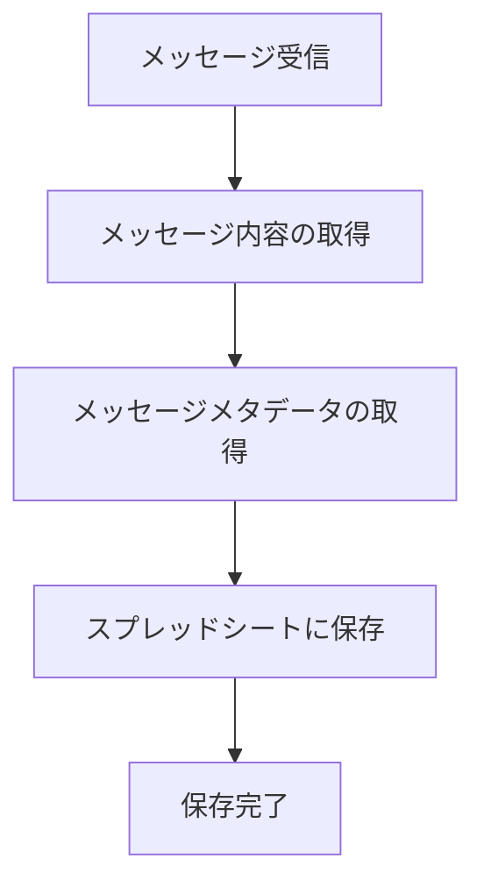
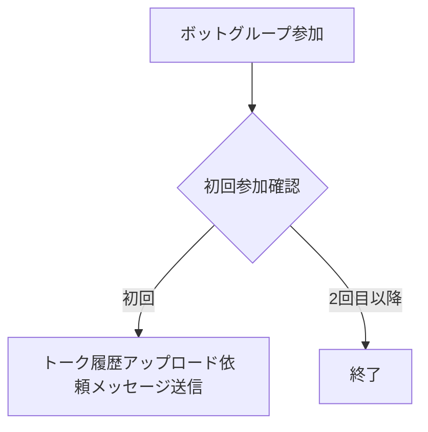
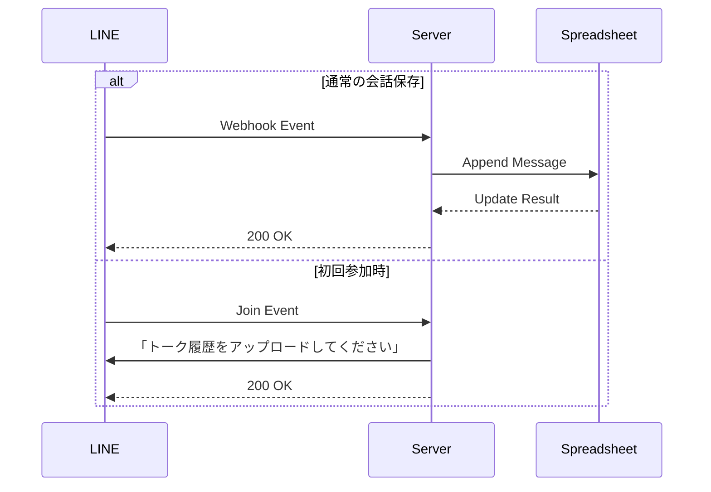

# トーク履歴取得保存機能設計書

## 機能情報
- **タイトル**: トーク履歴取得保存機能
- **バージョン**: 0.1.0
- **優先度**: high
- **予想開発時間**: 1週間

## 機能概要
LINEグループのトーク履歴を自動的に保存し、ボットが新しくグループに追加された際に過去の履歴を取得する機能。

## フロー図

### 通常の会話保存フロー


### 初回参加時のフロー


### API連携フロー


## 技術仕様

### スプレッドシート構造

グループごとに個別のシートを作成し、トーク履歴を保存します。各シートの名前はグループIDとなります。

各シートのヘッダー行（A1:H1）は以下の値を持ちます：

```
["Timestamp", "Group ID", "Group Name", "Group Picture URL", "User ID", "User Name", "Message Type", "Content"]
```

新しいグループが検出されると、自動的に新しいシートが作成されます。

### データモデル
```typescript
// メッセージデータの構造
interface MessageData {
  timestamp: string;       // メッセージ送信時刻
  groupId: string;        // グループID
  groupName: string;      // グループ名
  groupPictureUrl?: string; // グループアイコンURL
  userId: string;         // ユーザーID
  userName: string;       // ユーザー名
  messageType: string;    // メッセージタイプ（text, image, etc）
  content: string;        // メッセージ内容
}

// メッセージテンプレート
const JOIN_MESSAGE = {
  type: 'textV2',
  text: 'こんにちは！グループのトーク履歴を取得できるように、過去のトーク履歴を.txt形式でこのグループにアップロードしてください。'
} as const;
```

### イベントハンドラー
```typescript
// メッセージイベント
interface MessageEvent {
  type: 'message';
  message: {
    type: string;
    text?: string;
  };
  source: {
    type: 'group';
    groupId: string;
    userId: string;
  };
  timestamp: number;
}

// グループ参加イベント
interface JoinEvent {
  type: 'join';
  source: {
    type: 'group';
    groupId: string;
  };
  timestamp: number;
}

async function handleMessageEvent(event: MessageEvent): Promise<void> {
  try {
    // メッセージを保存
    await talkHistoryService.saveMessage(event);
  } catch (error) {
    console.error('Error handling message event:', error);
    throw error;
  }
}

async function handleJoinEvent(event: JoinEvent): Promise<void> {
  try {
    // グループ参加時の処理
    await talkHistoryService.handleJoinEvent(event);
    
    // 初回参加メッセージを送信
    if (event.source.type === 'group') {
      await client.pushMessage({
        to: event.source.groupId,
        messages: [JOIN_MESSAGE]
      });
    }
  } catch (error) {
    console.error('Error handling join event:', error);
    throw error;
  }
}
```

### 必要なパッケージ
- @line/bot-sdk
- google-spreadsheet
- @google-cloud/local-auth
- date-fns

### エラーハンドリング
- LINE Messaging APIのエラー処理
- グループ参加イベントのハンドリング失敗時の処理
- スプレッドシート書き込み失敗時のリトライ処理
- Google APIのレート制限対応

## 実装ステップ

### 1. サービスの実装

`src/services/talkHistory.ts` に以下の機能を実装しました：

- `saveMessage`: メッセージをスプレッドシートに保存
- `ensureSheetExists`: グループ用のシートが存在するか確認し、必要に応じて作成
- `getGroupSummary`: LINE APIを使用してグループ情報を取得
- `createMessageData`: メッセージイベントからデータを作成
- `convertToRow`: メッセージデータをスプレッドシートの行に変換
- `appendToSheet`: データをスプレッドシートに追加
- `handleJoinEvent`: グループ参加イベントを処理

### 2. ハンドラーの実装

`src/handlers/talkHistory.ts` に以下の機能を実装しました：

- `handleTalkHistory`: イベントタイプに基づいて適切なハンドラーに振り分け
- `handleMessageEvent`: メッセージイベントを処理
- `handleJoinEvent`: グループ参加イベントを処理し、ウェルカムメッセージを送信

### 3. Webhookハンドラーの更新

`src/handlers/webhook-handler.ts` を更新してトーク履歴処理を組み込みました：

```typescript
const results = await Promise.all(events.map(async (event) => {
  // トーク履歴の保存
  await handleTalkHistory(event);
  // 通常のメッセージ処理
  return handleMessage(event);
}));
```

## セキュリティ考慮事項
- LINE Messaging APIのチャネルアクセストークンの安全な管理
- Google Cloud Projectの認証情報の安全な管理
- スプレッドシートの共有設定とアクセス権限
- グループIDの検証
- ユーザー情報の適切な取り扱い

## テスト計画
1. メッセージ保存機能のユニットテスト
2. 履歴取得機能の統合テスト
3. エラーケースのテスト
4. パフォーマンステスト（大量のメッセージ処理）

## 監視計画
- LINE Messaging APIの使用量と制限
- Google Spreadsheet APIの使用量と制限
- スプレッドシートの行数と使用量
- エラー発生率
- メッセージ保存の成功率

## 展開計画
1. 開発環境での機能実装
2. テスト環境でのバグ修正
3. ステージング環境での検証
4. 本番環境への段階的デプロイ
