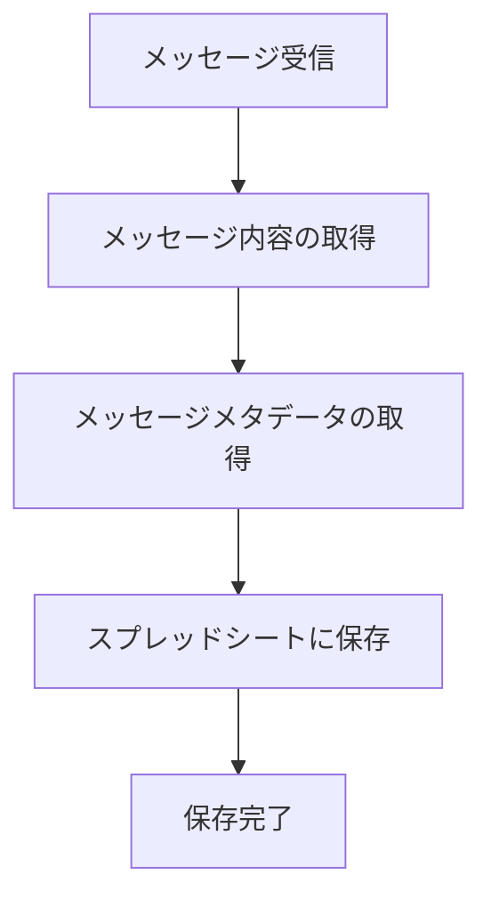
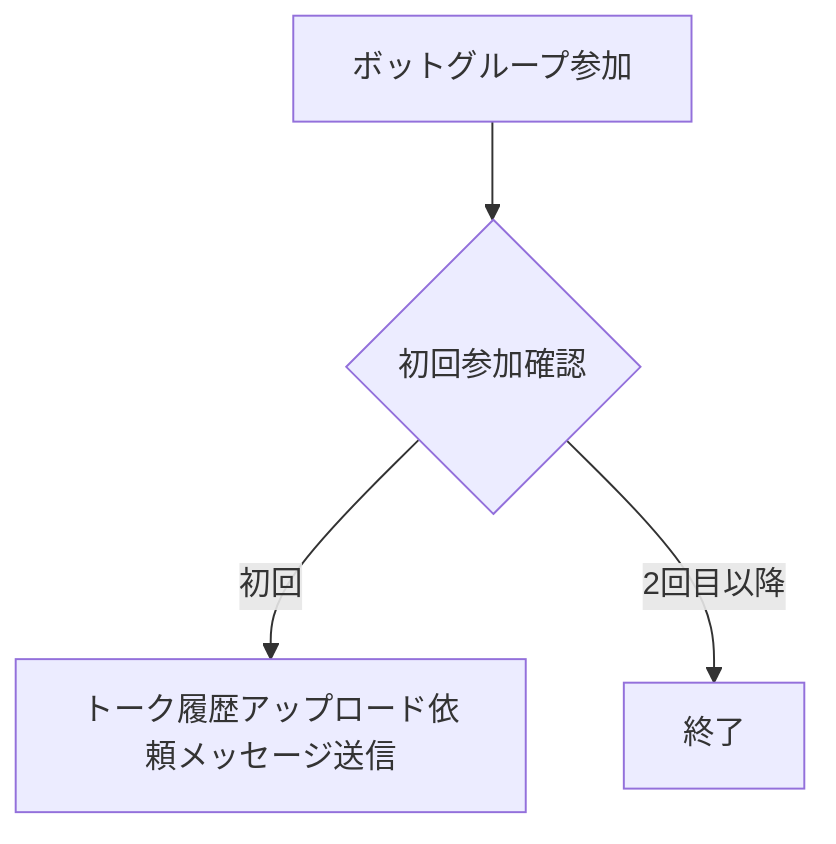
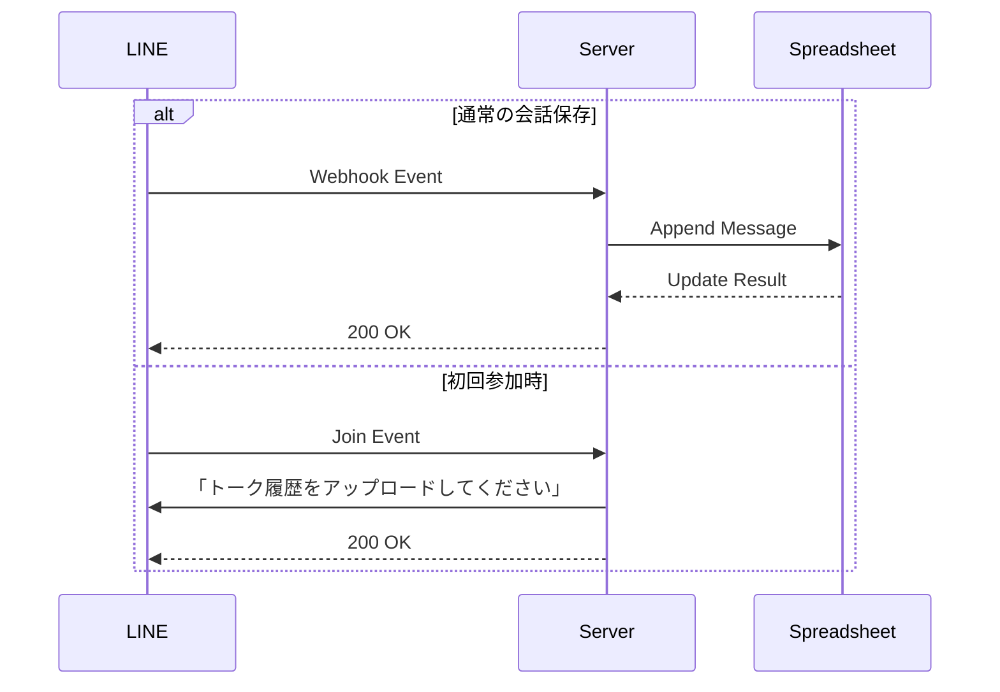

# トーク履歴取得保存機能設計書

## 機能情報
- **タイトル**: トーク履歴取得保存機能
- **バージョン**: 0.1.0
- **優先度**: high
- **予想開発時間**: 1週間

## 機能概要
LINEグループのトーク履歴を自動的に保存し、ボットが新しくグループに追加された際に過去の履歴を取得する機能。

## フロー図

### 通常の会話保存フロー


### 初回参加時のフロー


### API連携フロー


## 技術仕様

### データモデル
```typescript
// メッセージシートの構造
interface MessageSheet {
  timestamp: Date;        // メッセージ送信時刻
  groupId: string;        // グループID
  groupName: string;      // グループ名
  userId: string;         // ユーザーID
  userName: string;       // ユーザー名
  messageType: string;    // メッセージタイプ（text, image, etc）
  content: string;        // メッセージ内容
}

// メッセージテンプレート
const JOIN_MESSAGE = {
  type: 'text',
  text: 'こんにちは！グループのトーク履歴を取得できるように、過去のトーク履歴を.txt形式でこのグループにアップロードしてください。'
};
```

### イベントハンドラー
```typescript
// メッセージイベント
interface MessageEvent {
  type: 'message';
  message: {
    type: string;
    text?: string;
  };
  source: {
    type: 'group';
    groupId: string;
    userId: string;
  };
  timestamp: number;
}

// グループ参加イベント
interface JoinEvent {
  type: 'join';
  source: {
    type: 'group';
    groupId: string;
  };
  timestamp: number;
}

async function handleMessageEvent(event: MessageEvent) {
  const { groupId, userId } = event.source;
  const { type, text } = event.message;
  
  // グループとユーザーの情報を取得
  const [groupProfile, userProfile] = await Promise.all([
    client.getGroupProfile(groupId),
    client.getProfile(userId)
  ]);

  // スプレッドシートに保存
  await appendToSheet({
    timestamp: new Date(event.timestamp),
    groupId,
    groupName: groupProfile.groupName,
    userId,
    userName: userProfile.displayName,
    messageType: type,
    content: text || ''
  });
}

async function handleJoinEvent(event: JoinEvent) {
  const { groupId } = event.source;
  if (isFirstJoin(groupId)) {
    await client.pushMessage(groupId, JOIN_MESSAGE);
  }
}
```

### 必要なパッケージ
- @line/bot-sdk
- google-spreadsheet
- @google-cloud/local-auth
- date-fns

### エラーハンドリング
- LINE Messaging APIのエラー処理
- グループ参加イベントのハンドリング失敗時の処理
- スプレッドシート書き込み失敗時のリトライ処理
- Google APIのレート制限対応

## セキュリティ考慮事項
- LINE Messaging APIのチャネルアクセストークンの安全な管理
- Google Cloud Projectの認証情報の安全な管理
- スプレッドシートの共有設定とアクセス権限
- グループIDの検証
- ユーザー情報の適切な取り扱い

## テスト計画
1. メッセージ保存機能のユニットテスト
2. 履歴取得機能の統合テスト
3. エラーケースのテスト
4. パフォーマンステスト（大量のメッセージ処理）

## 監視計画
- LINE Messaging APIの使用量と制限
- Google Spreadsheet APIの使用量と制限
- スプレッドシートの行数と使用量
- エラー発生率
- メッセージ保存の成功率

## 展開計画
1. 開発環境での機能実装
2. テスト環境でのバグ修正
3. ステージング環境での検証
4. 本番環境への段階的デプロイ
