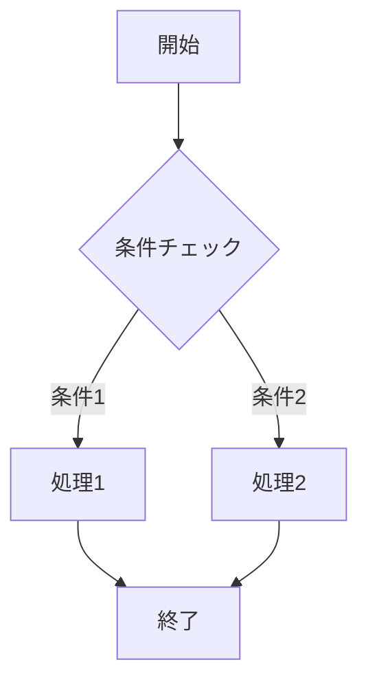
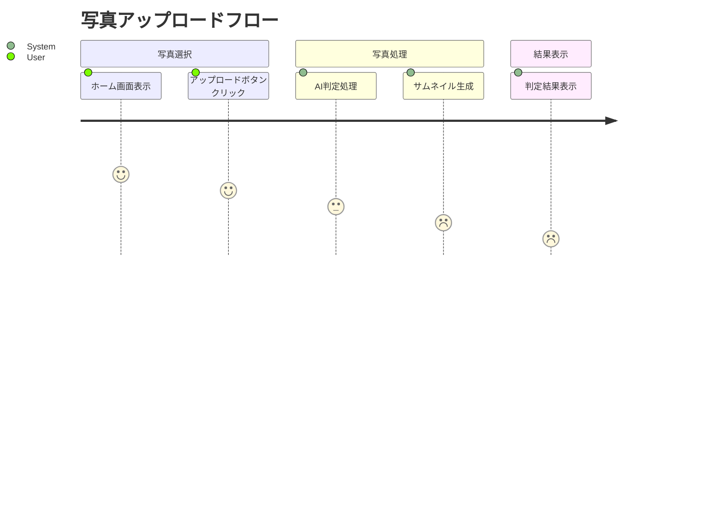
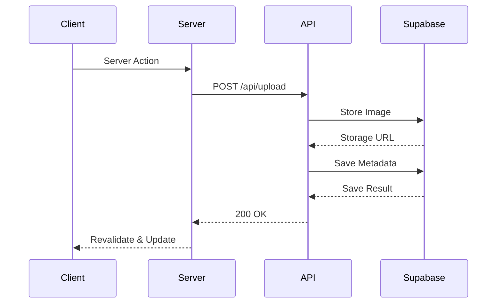

# 機能設計書

## 機能情報
- **タイトル**: [機能名/タスク名]
- **バージョン**: 0.1.0
- **優先度**: [high/medium/low]
- **予想開発時間**: [予想される開発時間]

## フロー図

### 処理フロー


### 画面操作フロー


### API連携フロー


## 概要
### 説明
[機能の詳細な説明]

### 目的
[この機能が解決する課題や目的]

### ユーザーストーリー
[どのようにユーザーがこの機能を使用するか]

## プロジェクト参照
- **リポジトリ**: [https://github.com/user/repo]
- **README**: [/README.md]
- **システム設計**: [/docs/dev-structure.yaml]
- **関連ドキュメント**:
  - [/docs/related-doc1.md]
  - [/docs/related-doc2.md]

## 依存関係
### フレームワーク
- Next.js 14
- React 18
- TypeScript 5
- TailwindCSS 3

### ライブラリ
| ライブラリ名 | バージョン | 使用目的 |
|------------|-----------|--------|
| [名前] | [バージョン] | [目的] |

## ファイル構造
### 新規作成ファイル
#### `/src/app/[feature]/page.tsx`
- **目的**: ページコンポーネント
- **種類**: Server Component
- **依存関係**:
  - `/src/components/ui`
  - `/src/lib/utils`
  - `/src/lib/actions`

#### `/src/app/[feature]/layout.tsx`
- **目的**: レイアウト定義
- **種類**: Server Component

#### `/src/app/[feature]/loading.tsx`
- **目的**: ローディングUI
- **種類**: Server Component

#### `/src/app/[feature]/error.tsx`
- **目的**: エラーハンドリング
- **種類**: Client Component

#### `/src/app/api/[feature]/route.ts`
- **目的**: APIエンドポイント
- **種類**: Route Handler

#### `/src/components/[feature]/index.tsx`
- **目的**: クライアントコンポーネント
- **種類**: Client Component

#### `/src/lib/actions/[feature].ts`
- **目的**: Server Actionsの実装

#### `/src/lib/types/[feature].ts`
- **目的**: 型定義

### 修正が必要なファイル
| ファイルパス | 変更内容 |
|------------|----------|
| `/src/app/layout.tsx` | レイアウトの更新 |
| `/src/lib/types/index.ts` | 新しい型の追加 |
| `/src/middleware.ts` | ミドルウェアの設定 |

## データベース変更
### テーブル変更
#### [テーブル名]
| カラム名 | データ型 | 制約 |
|---------|---------|------|
| [名前] | [型] | [制約] |

### SQLマイグレーション
```sql
-- マイグレーションファイル: supabase/migrations/[timestamp]_description.sql
BEGIN;

-- スキーマ変更のSQLコマンド
CREATE TABLE IF NOT EXISTS public.new_table (
  id BIGINT GENERATED BY DEFAULT AS IDENTITY PRIMARY KEY,
  created_at TIMESTAMP WITH TIME ZONE DEFAULT NOW()
);

COMMENT ON TABLE public.new_table IS 'New table description';

COMMIT;
````

**スキーマ更新チェックリスト**:

- [ ] マイグレーションファイルの作成
- [ ] ローカル環境でのスキーマテスト
- [ ] 本番環境への適用手順の確認

## データ操作のベストプラクティス

### Server Actions
- **使用ケース**:
  - フォーム送信処理
  - データの作成・更新・削除
  - ユーザー操作によるデータ変更

- **実装例**:
```typescript
'use server'

export async function createItem(formData: FormData) {
  const data = await db.items.create({
    data: Object.fromEntries(formData)
  })
  revalidatePath('/items')
  return data
}
```

### Server Components
- **使用ケース**:
  - データの取得・表示
  - SEOが必要なページ
  - 大量のデータ表示

- **実装例**:
```typescript
export default async function ItemList() {
  const items = await db.items.findMany()
  return (
    <ul>
      {items.map(item => (
        <li key={item.id}>{item.name}</li>
      ))}
    </ul>
  )
}
```

### API Routes
- **使用ケース**:
  - 外部APIとの連携
  - 複雑なデータ処理
  - Webhookのハンドリング

- **実装例**:
```typescript
// app/api/webhook/route.ts
export async function POST(request: Request) {
  const payload = await request.json()
  // 複雑なデータ処理
  return Response.json({ success: true })
}
```

## API エンドポイント

### [エンドポイントパス]

- **メソッド**: [GET/POST/PUT/DELETE]
- **リクエストボディ**:
  ```json
  {
    // リクエストボディの構造
  }
  ```
- **レスポンス**:
  ```json
  {
    // レスポンスの構造
  }
  ```

## テスト要件

### ユニットテスト

- [ ] テストケース 1 の説明
- [ ] テストケース 2 の説明

### 統合テスト

- [ ] 統合テストケース 1 の説明

## デプロイメント

### 手順

1. デプロイ手順 1
2. デプロイ手順 2

### 環境変数

- `[環境変数1]`
- `[環境変数2]`

## セキュリティ考慮事項

- [ ] セキュリティ上の考慮事項 1
- [ ] セキュリティ上の考慮事項 2

## 備考

- その他の注意点や備考
