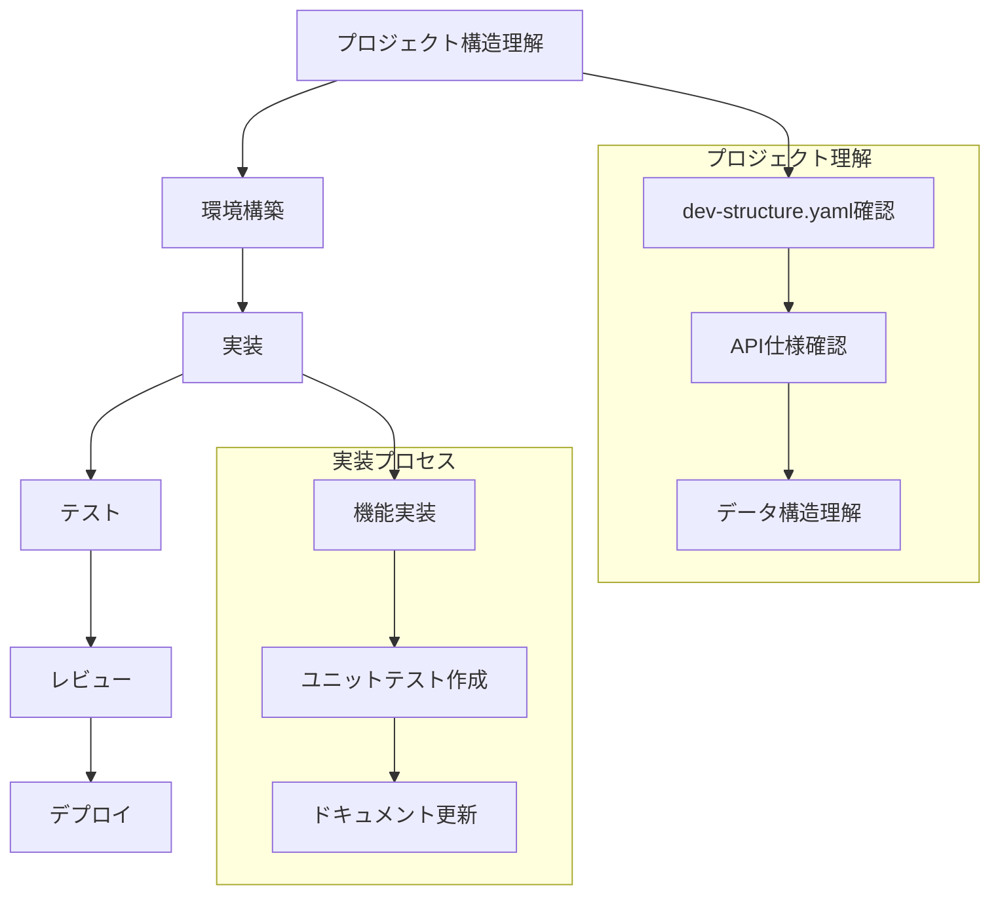

# 開発ワークフロー

## 開発フロー概要



## 1. プロジェクト構造の理解

1. `docs/dev-structure.yaml`を確認
   - アプリケーションの全体像を把握
   - 技術スタックの確認
   - データ構造の理解
   - 必要なAPI連携の確認

## 2. 環境構築フェーズ

環境構築に関する詳細な手順は `docs/setup.md` を参照してください。

## 3. 実装フェーズ

1. 機能実装
   - タスクの分析と設計
   - コード実装
   - コードレビューの反映

2. テスト実装
   - ユニットテストの作成
   - 統合テストの作成
   - テストカバレッジの確認

3. ドキュメント更新
   - API仕様書の更新
   - コードコメントの追加
   - READMEの更新

## 4. テストフェーズ

1. ユニットテスト
   - 個々の機能の動作確認
   - エッジケースの確認
   - エラーハンドリングの確認

2. 統合テスト
   - コンポーネント間の連携確認
   - エンドツーエンドの動作確認
   - パフォーマンス確認

3. レビュー
   - コードレビュー
   - 機能レビュー
   - ドキュメントレビュー

## 5. デプロイフェーズ

1. ビルドとテスト
   - 本番環境用のビルド
   - テストの実行
   - ビルド成果物の確認

2. デプロイ手順
   - デプロイスクリプトの実行
   - ログの確認
   - バックアップの確認

3. 動作確認
   - システムヘルスチェック
   - パフォーマンスモニタリング
   - セキュリティ確認

1. デプロイ準備
   - 環境変数の設定
   - SSL証明書の準備
   - デプロイスクリプトの作成

2. デプロイ手順
   ```bash
   # ビルド
   npm run build
   
   # デプロイ（プラットフォームに応じて）
   npm run deploy
   ```

3. デプロイ後の確認
   - Webhook URLの疎通確認
   - LINE Botの応答確認
   - スプレッドシートの更新確認

## 6. 保守・運用フェーズ

1. モニタリング
   - エラーログの監視
   - パフォーマンス監視
   - API利用状況の確認

2. バックアップ
   - スプレッドシートの定期バックアップ
   - 設定情報のバックアップ

3. アップデート管理
   - 依存パッケージの更新
   - セキュリティパッチの適用
   - 機能改善の実装

## チェックリスト

### 環境構築前
- [ ] LINE Developersアカウントの準備
- [ ] Google Cloud Platformアカウントの準備
- [ ] 必要なAPIキーの取得

### 実装前
- [ ] Webhook URLの設定確認
- [ ] スプレッドシートの共有設定
- [ ] 環境変数の設定

### 実装中
- [ ] メッセージパーサーの実装
- [ ] Sheets API連携の実装
- [ ] エラーハンドリングの実装
- [ ] レポート機能の実装

### テスト前
- [ ] LINE Botの応答テスト
- [ ] データ記録の確認
- [ ] レポート生成の確認

### デプロイ前
- [ ] SSL証明書の準備
- [ ] 環境変数の設定確認
- [ ] バックアップの実施

### デプロイ後
- [ ] Webhookの疎通確認
- [ ] LINE Botの動作確認
- [ ] スプレッドシートの更新確認
- [ ] エラーログの確認

## 定期的な見直し

1. コード品質
   - TypeScriptの型定義の見直し
   - エラーハンドリングの改善
   - パフォーマンスの最適化

2. セキュリティ
   - APIキーのローテーション
   - 依存パッケージの脆弱性チェック
   - アクセス権限の見直し

3. ドキュメント
   - API仕様書の更新
   - 運用手順の改善
   - トラブルシューティングガイドの拡充

> **Note**
> 定期的なメンテナンスとアップデートにより、
> アプリケーションの安定性と信頼性を維持します。
